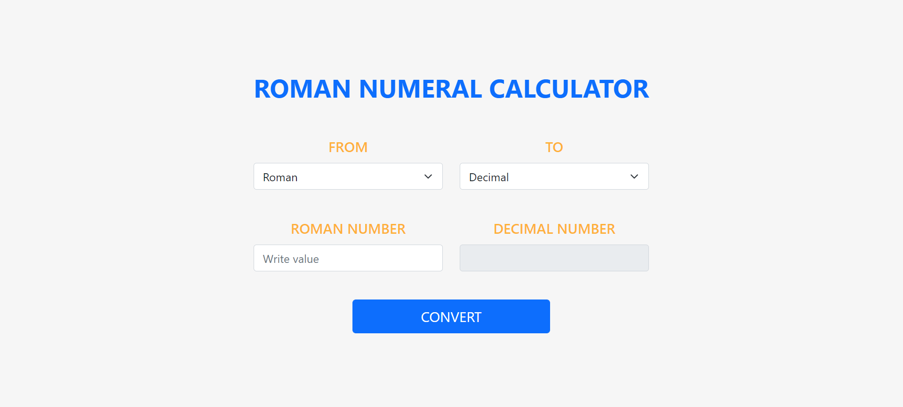
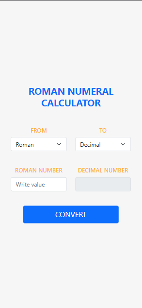

# ROMAN NUMERAL CALCULATOR

Calculator that allows you to convert Roman numerals to Decimal numbers and vice versa using hash tables.

1.  Main menu with the calculator component.
2.  Responsive design.

# Deployment

VERCEL:

[LINK](https://roman-numeral-calculator.vercel.app/)

## Screenshots

Desktop version:

Mobile version:

## Libraries

1.  [React](https://es.reactjs.org/)
2.  [React Bootstrap](https://www.typescriptlang.org/)
3.  [Redux](https://mui.com/)

## Install and run project

1. Clone repo.
2. Install modules `npm install` .
3. Run project `npm start`
